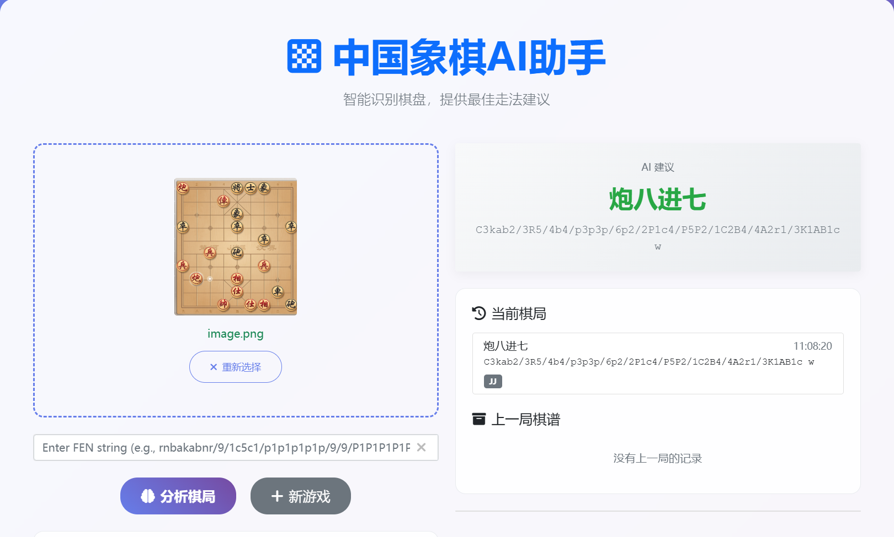
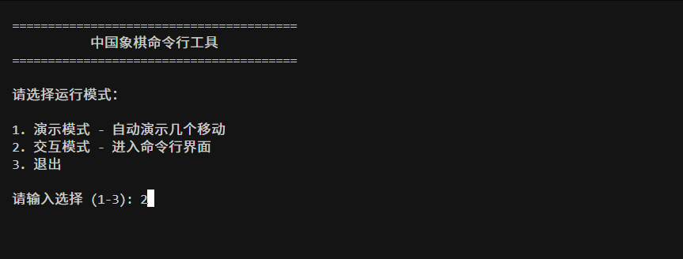
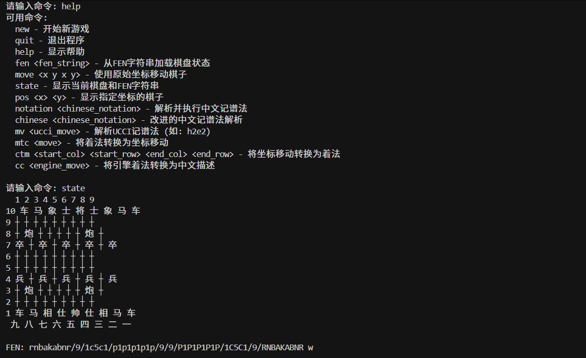

# 象棋小助手（ChessMate）

## 项目简介
ChessMate 是一个基于 Flask 的中国象棋辅助分析平台，集成了图像识别与 AI 引擎，自动识别棋盘截图并给出最佳走法建议，支持 JJ 象棋等主流平台。

## 功能特点
- 智能图片识别棋局，生成fen字符串
- AI引擎分析，最佳走法依靠[云库](https://www.chessdb.cn/) 和[皮卡鱼（Pikafish)](https://github.com/official-pikafish/Pikafish)
- 多平台支持
- 提供命令行中国象棋助手
- 历史记录
- 现代化前端
- 日志与错误处理

---
## UI 截图
- web界面

- 命令行



---
## 安装说明

### 克隆仓库
```bash
git clone https://github.com/lbinf/ChessMate
cd ChessMate
```

### 安装依赖
```bash
pip install -r requirements.txt
```

### 确保Pikafish引擎可执行
Pikafish编译及用法可参考：https://github.com/official-pikafish/Pikafish

```bash
chmod +x ./app/Pikafish/src/pikafish
```

### 运行应用
```bash
python run.py
```

### 运行命令行
- linux
```
./start_chess.sh
```
- window
```
start_chess.bat
```
- python
```
python chess_cli.py --cli
```
---

## 测试
- 运行所有测试：
```bash
pytest
```
- 覆盖 API、算法、数据库等。

---

## 部署
- 本地开发：`python run.py`
- 生产环境：`gunicorn -c gunicorn.conf.py run:app`
- Docker: `docker-compose up -d`
- 详见 [doc/DEPLOYMENT_GUIDE.md](doc/DEPLOYMENT_GUIDE.md)

---

## 贡献指南
- 遵循 PEP8
- 重要代码需注释
- 保证测试通过
- 欢迎 PR 和 Issue

---

## 已完成功能
- 棋盘图片自动识别
- AI引擎分析
- 多平台适配
- 参数调优
- 基础前端
- 日志与错误处理
- 单元/集成测试

---

## License

MIT
- 详见 [LICENSE](LICENSE)

## 致谢
- Pikafish
- OpenCV
- Flask
- Bootstrap 